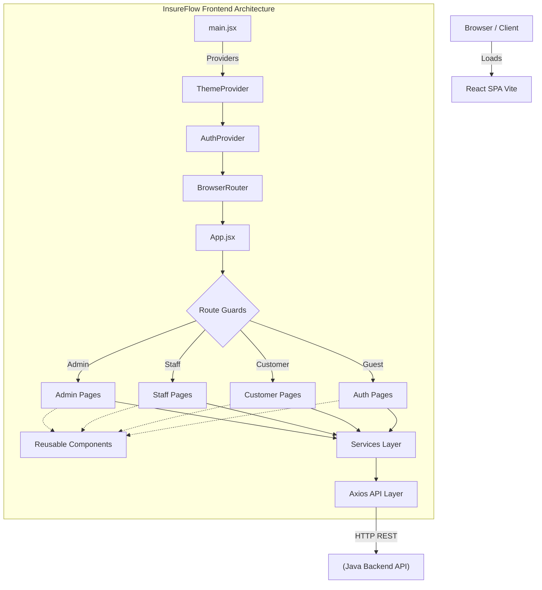
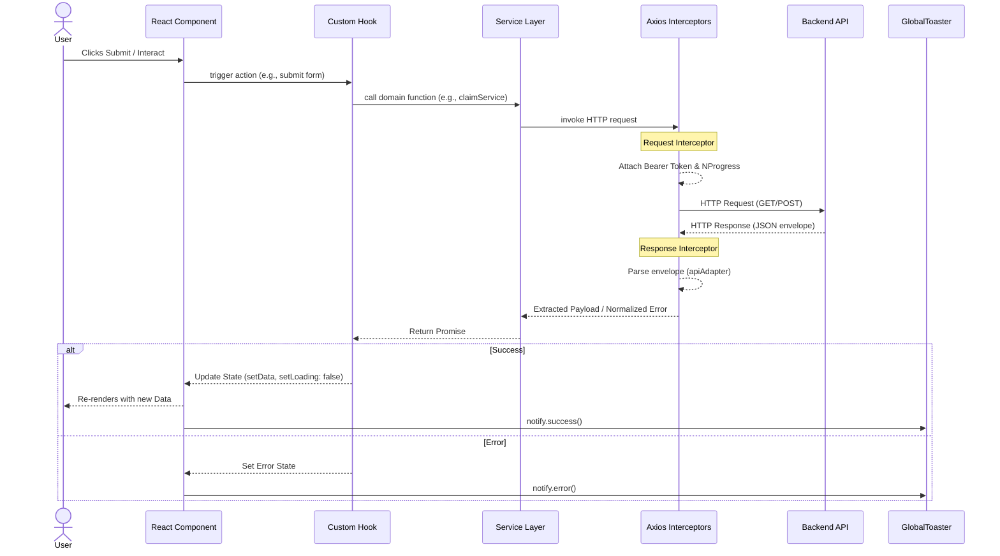

# Architecture Overview

> **What:** The high-level system architecture of the InsureFlow frontend.  
> **Why:** To help developers understand how every layer connects before they touch any specific file.  
> **How:** React 19 SPA, Vite-bundled, routing via React Router v7, state via Context API, API via Axios interceptors.

---

## System-Level Architecture



---

## Folder Structure

```
src/
├── api/
│   ├── axiosInstance.js        ← Configured Axios with interceptors
│   ├── apiAdapter.js           ← Parses success/error envelopes from backend
│   └── apiTypes.js             ← JSDoc type definitions for API contracts
│
├── context/
│   ├── AuthContext.jsx         ← User auth state (token, user, login, logout)
│   └── ThemeContext.jsx        ← Light/dark theme state
│
├── hooks/
│   ├── useAuth.js              ← Access AuthContext
│   ├── useTheme.js             ← Access ThemeContext
│   ├── useApiForm.js           ← Form submission lifecycle hook
│   ├── useApiTable.js          ← Paginated data fetching hook
│   ├── useTableState.js        ← Sorting + filtering + pagination state
│   ├── usePagination.js        ← Page/size/totalPages state
│   ├── useDebounceFilters.js   ← Debounced filter inputs
│   ├── useDebounce.js          ← Generic debounce
│   ├── useSearch.js            ← Search state helper
│   └── useDocumentTitle.js     ← Set <title> per page
│
├── services/
│   ├── authService.js          ← Login, Register, OTP, Password
│   ├── userService.js          ← User CRUD (admin)
│   ├── customerService.js      ← Customer profile CRUD
│   ├── productService.js       ← Insurance product CRUD
│   ├── planService.js          ← Plan CRUD
│   ├── policyService.js        ← Policy purchase, issue, cancel
│   ├── paymentService.js       ← Payment recording and history
│   ├── claimService.js         ← Raise, review, approve/reject claims
│   └── dashboardService.js     ← Aggregated dashboard statistics
│
├── pages/
│   ├── auth/                   ← Login, Register, ForgotPassword, VerifyOtp
│   ├── admin/                  ← Admin-only pages
│   │   ├── AdminDashboard.jsx
│   │   ├── users/              ← UserListPage, CreateStaffPage, UserDetailPage
│   │   ├── customers/          ← CustomerListPage, CustomerDetailPage
│   │   ├── products/           ← ProductListPage, CreateProductPage, EditProductPage, ProductDetailPage
│   │   ├── plans/              ← PlanListPage, CreatePlanPage, EditPlanPage, PlanDetailPage
│   │   ├── policies/           ← PolicyListPage, PolicyDetailPage, IssuePolicyPage
│   │   ├── claims/             ← ClaimListPage, ClaimDetailPage
│   │   └── payments/           ← PaymentListPage
│   ├── staff/                  ← Staff-only pages
│   │   ├── StaffDashboard.jsx
│   │   ├── customers/          ← StaffCustomerListPage, StaffCustomerDetailPage
│   │   ├── policies/           ← StaffPolicyListPage, StaffPolicyDetailPage, StaffIssuePolicyPage
│   │   ├── claims/             ← StaffClaimListPage, StaffClaimDetailPage
│   │   └── payments/           ← StaffPaymentListPage, StaffRecordPaymentPage
│   ├── customer/               ← Customer-only pages
│   │   ├── CustomerDashboard.jsx
│   │   ├── profile/            ← ProfilePage, EditProfilePage
│   │   ├── products/           ← CustomerProductListPage
│   │   ├── plans/              ← CustomerPlanListPage
│   │   ├── policies/           ← CustomerPolicyListPage, CustomerPolicyDetailPage, PurchasePolicyPage
│   │   ├── payments/           ← CustomerPaymentHistoryPage, RecordPaymentPage
│   │   └── claims/             ← CustomerClaimListPage, RaiseClaimPage, ClaimDetailsPage, UploadDocumentsPage
│   ├── shared/                 ← NotFound, Unauthorized
│   └── LandingPage.jsx
│
├── components/
│   ├── layouts/                ← UnifiedLayout.jsx (main shell)
│   ├── navigation/             ← Sidebar.jsx, TopNavbar.jsx
│   ├── common/                 ← GlobalApiHandler, GlobalToaster, LoadingSpinner, PageHeader, ExportButton
│   ├── tables/                 ← DataTable, PaginationBar, SortableHeader, TableToolbar
│   ├── forms/                  ← FormInput, FormSelect, FormTextarea, ModernDatePicker, ModernSelect
│   ├── cards/                  ← DashboardCard
│   ├── modals/                 ← ConfirmModal, AlertModal, DocumentPreviewModal
│   ├── ui/                     ← StatusBadge, EmptyState, ErrorAlert, Modal, LoadingButton, FilterPanel, FilterChips, Drawer
│   ├── claims/                 ← Claim-specific components
│   └── auth/                   ← Auth-specific components (ResendOtp)
│
└── utils/
    ├── roles.js                ← ROLES constants and ROLE_HOME map
    ├── statuses.js             ← Status enum constants
    ├── options.js              ← Dropdown options (payment modes, policy statuses, etc.)
    ├── validators.js           ← Reusable field validators
    ├── formatters.js           ← formatDate, formatCurrency
    ├── labels.js               ← EMPTY_STATES, TOAST_MESSAGES, FORM_LABELS
    ├── documentCategories.js   ← Document types per product type
    ├── exportUtils.js          ← CSV export utility
    ├── notificationService.js  ← notify.success / notify.error / notify.warning / notify.info
    ├── errorHandler.js         ← handleApiError (wraps field errors vs standard errors)
    ├── apiResponse.js          ← extractValidationErrors helper
    └── constants.js            ← Miscellaneous app constants
```

---

## Data Flow: From User Action to UI Update



---

## Multi-Role Architecture Pattern

The application uses **role-based isolation** at every layer:

| Layer                  | Mechanism                                                                      |
| ---------------------- | ------------------------------------------------------------------------------ |
| **Routes**             | `RoleProtectedRoute` component checks `user.role`                              |
| **Sidebar Navigation** | `NAV_ITEMS_BY_ROLE` map in `UnifiedLayout.jsx`                                 |
| **Theme**              | `THEME_CLASS_BY_ROLE` CSS class per role                                       |
| **Portal Title**       | `PORTAL_TITLE_BY_ROLE` string per role                                         |
| **Services**           | Separate API endpoints per role (e.g., `/policies/my-policies` vs `/policies`) |

---

## Application Bootstrap Sequence

```
index.html → main.jsx
  └─ ThemeProvider (reads localStorage 'ss_theme', applies data-theme to <html>)
      └─ AuthProvider (reads localStorage 'ss_token' + 'ss_user')
          └─ BrowserRouter
              └─ App.jsx
                  ├─ GlobalApiHandler (window event listeners for auth events)
                  ├─ GlobalToaster (react-hot-toast configuration)
                  └─ <Routes> (with statically imported, zero-latency pages)
```

---

## Security Architecture

| Concern                | Implementation                                                                         |
| ---------------------- | -------------------------------------------------------------------------------------- |
| **Token Storage**      | `localStorage` under key `ss_token`                                                    |
| **Token Injection**    | Axios request interceptor reads `ss_token` and injects `Authorization: Bearer <token>` |
| **Token Expiry (401)** | Axios response interceptor clears token, dispatches `auth:unauthorized` window event   |
| **Forbidden (403)**    | Dispatches `auth:forbidden` event → navigates to `/unauthorized`                       |
| **Route Guard**        | `ProtectedRoute` → redirects to `/login` if not authenticated                          |
| **Role Guard**         | `RoleProtectedRoute` → redirects to correct dashboard if wrong role                    |
| **Guest Guard**        | `GuestRoute` → redirects authenticated users away from login/register                  |
| **Password Encoding**  | Passwords encoded with `btoa()` before transmission                                    |

---

## Related Documentation

- [Routing](../routing/routing.md)
- [State Management](../contexts/state-management.md)
- [Axios Layer](../services/axios-layer.md)
- [Services Overview](../services/services-overview.md)
