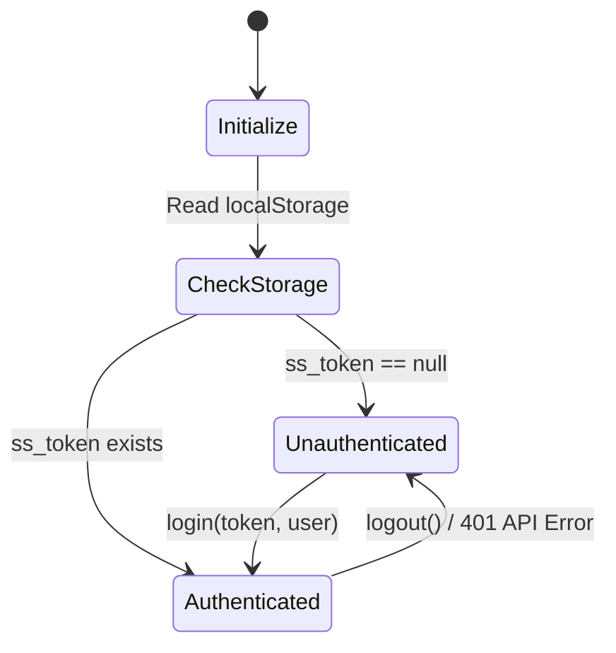
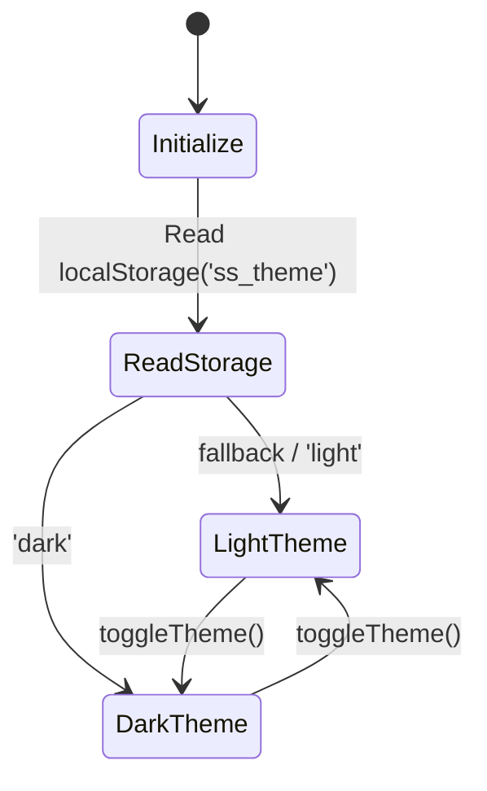

# State Management

> **What:** How application state is managed across the InsureFlow frontend.  
> **Why:** Understanding state management is critical for debugging re-render issues, authentication bugs, and component communication.  
> **How:** Primarily React Context API + local `useState`. No Redux or Zustand.  
> **Where:** `src/context/`, `src/hooks/`

---

## Context Architecture

```
ThemeProvider
  └─ AuthProvider
       └─ BrowserRouter
            └─ App
                 └─ (all pages + components)
```

Both providers wrap the entire application, so any component at any depth can access them via `useAuth()` or `useTheme()`.

---

## AuthContext



**File:** [`src/context/AuthContext.jsx`](../../src/context/AuthContext.jsx)  
**Hook:** [`src/hooks/useAuth.js`](../../src/hooks/useAuth.js)

### What it manages

| State | Type | Persistence | Purpose |
|---|---|---|---|
| `token` | `string \| null` | `localStorage:ss_token` | Current JWT |
| `user` | `object \| null` | `localStorage:ss_user` | `{ id, email, role, name, productSpeciality }` |
| `isAuthenticated` | `boolean` (derived) | - | `!!token` |

### Initialization (persistent login)

State initializes from localStorage on first render:

```js
const [token, setToken] = useState(() => localStorage.getItem("ss_token"));
const [user, setUser] = useState(() => {
  try { return JSON.parse(localStorage.getItem("ss_user")); }
  catch { return null; }
});
```

This means a page refresh does **not** log the user out.

### `login(newToken, newUser)`

```js
localStorage.setItem("ss_token", newToken);
localStorage.setItem("ss_user", JSON.stringify(newUser));
setToken(newToken);
setUser(newUser);
```

### `logout()`

```js
localStorage.setItem("isLoggingOut", "true");  // Prevents redirect loop
localStorage.removeItem("ss_token");
localStorage.removeItem("ss_user");
setToken(null);
setUser(null);
```

The `isLoggingOut` flag is checked by `ProtectedRoute` to distinguish intentional logout from session expiry.

### Context Value

```js
{ token, user, isAuthenticated, login, logout }
```

### Usage in a Component

```jsx
import useAuth from '../../hooks/useAuth';

const MyComponent = () => {
  const { user, isAuthenticated, logout } = useAuth();
  // user.role === 'ROLE_CUSTOMER'
  // user.name === 'Priya Sharma'
};
```

---

## ThemeContext



**File:** [`src/context/ThemeContext.jsx`](../../src/context/ThemeContext.jsx)  
**Hook:** [`src/hooks/useTheme.js`](../../src/hooks/useTheme.js)

### What it manages

| State | Type | Persistence |
|---|---|---|
| `theme` | `'light' \| 'dark'` | `localStorage:ss_theme` |

### Side Effect

```js
useEffect(() => {
  document.documentElement.setAttribute('data-theme', theme);
  document.documentElement.setAttribute('data-bs-theme', theme);
  localStorage.setItem('ss_theme', theme);
}, [theme]);
```

### `toggleTheme()`

```js
setTheme(prev => prev === 'light' ? 'dark' : 'light');
```

### Context Value

```js
{ theme, toggleTheme }
```

### Usage

```jsx
const { theme, toggleTheme } = useContext(ThemeContext);
// or via hook:
const { theme, toggleTheme } = useTheme();
```

---

## Local Component State (useState)

Most page-level state uses `useState`. Common patterns:

### Loading State

```jsx
const [loading, setLoading] = useState(false);
const [data, setData] = useState(null);

useEffect(() => {
  const fetch = async () => {
    setLoading(true);
    try {
      const response = await service.getSomething();
      setData(response.data);
    } catch (err) {
      notify.error(err);
    } finally {
      setLoading(false);
    }
  };
  fetch();
}, []);
```

### Form State

**react-hook-form** is used in Login page:
```jsx
const { register, handleSubmit, formState: { errors }, watch } = useForm({
  defaultValues: { email: "", password: "" },
  mode: "onTouched"
});
```

Manual controlled state is used in Register, Profile, and most other forms:
```jsx
const [formData, setFormData] = useState({ field1: '', field2: '' });
const handleChange = (e) => {
  setFormData(prev => ({ ...prev, [e.target.name]: e.target.value }));
};
```

### Pagination + Filter State

Pages with tables use `useTableState()` which internally uses `useState` and `usePagination`:

```jsx
const tableState = useTableState({
  initialSortBy: 'createdDate',
  initialSortDirection: 'desc',
  initialFilters: { status: '', name: '' }
});

// In JSX:
<PaginationBar
  currentPage={tableState.currentPage}
  totalPages={tableState.totalPages}
  onPageChange={tableState.setCurrentPage}
/>
```

---

## Component Communication Patterns

### 1. Parent → Child: Props

The standard React pattern. Example: `DataTable` receives `data`, `columns`, `loading` from the page component.

```jsx
<DataTable
  columns={columns}
  data={data}
  loading={isLoading}
  onRowClick={(row) => navigate(`/admin/claims/${row.claimId}`)}
/>
```

### 2. Child → Parent: Callback Props

Example: `PaginationBar` calls `onPageChange` to notify the parent.

```jsx
// Parent
<PaginationBar
  currentPage={tableState.currentPage}
  totalPages={tableState.totalPages}
  onPageChange={(page) => tableState.setCurrentPage(page)}
/>
```

### 3. Cross-Component: Context

Used for auth state and theme. Available app-wide without prop drilling.

```jsx
const { user } = useAuth();
```

### 4. Cross-Component: DOM Events

Used for decoupled communication between `axiosInstance` (not a React component) and `GlobalApiHandler` (a React component):

```js
// In axiosInstance interceptor (non-React):
window.dispatchEvent(new CustomEvent('auth:unauthorized'));

// In GlobalApiHandler (React component):
window.addEventListener('auth:unauthorized', handleUnauthorized);
```

### 5. Navigation State (useLocation)

Used to pass data between pages during navigation without Redux or context:

```js
// Source page:
navigate('/verify-otp', { state: { email: 'user@example.com' } });

// Destination page:
const { email } = useLocation().state;
```

---

## useEffect Patterns

### Fetch on Mount

```jsx
useEffect(() => {
  fetchData();
}, []); // Empty deps = runs once on mount
```

### Fetch on Dependency Change

```jsx
useEffect(() => {
  fetchClaims(claimId);
}, [claimId]); // Refetches when claimId route param changes
```

### Cleanup

```jsx
useEffect(() => {
  window.addEventListener('auth:unauthorized', handler);
  return () => window.removeEventListener('auth:unauthorized', handler);
}, []);
```

---

## State Reset Patterns

### On Page Navigation

React Router unmounts pages on navigation, so component `useState` is reset automatically. No manual cleanup needed.

### On Filter Change (Table)

`useTableState.handleFilterChange` always resets `currentPage` to 1:

```js
const handleFilterChange = useCallback((updates) => {
  setFilters(prev => ({ ...prev, ...updates }));
  setCurrentPage(1); // Reset to first page
}, [setCurrentPage]);
```

### On Form Submission

`useApiForm.submit` always clears `fieldErrors` before a new call:

```js
const submit = async (payload) => {
  setLoading(true);
  setFieldErrors({});  // Clear previous errors
  // ...
};
```

---

## What NOT to Use

This project does **not** use:
- ❌ Redux (no global store)
- ❌ Zustand (no external state library)
- ❌ React Query / SWR (no server state caching)
- ❌ MobX

All state is either local `useState`, Context API, or URL-based (route params + location state).

---

## Related Documentation

- [Custom Hooks](../hooks/hooks.md)
- [Axios Layer](../services/axios-layer.md)
- [Architecture Overview](../architecture/overview.md)
