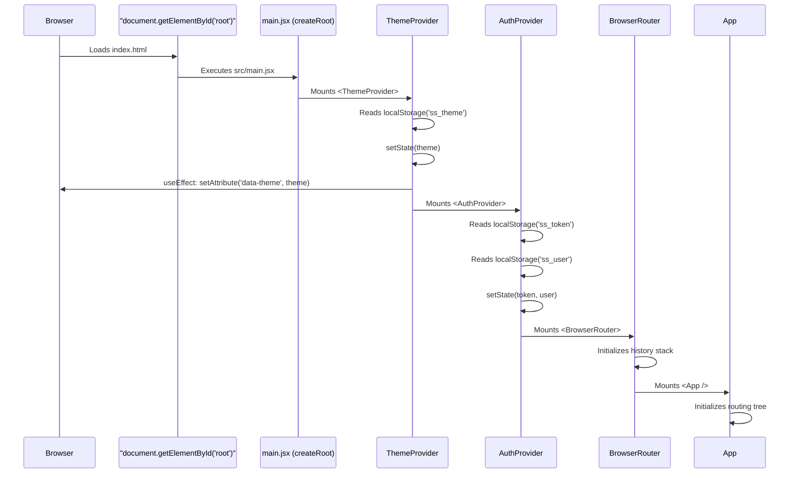

# Architecture and Global Flow Deep Dive

> **What:** Line-by-line execution flow for the initialization, routing, and global context of the application.
> **Why:** A Principal Engineer needs to know exactly what renders first, how auth state propagates, and what prevents unauthorized access at the component level.

---

## 1. Bootstrapping Execution Flow (`main.jsx`)

The React application mounts here.



---

## 2. The `<App />` Render Flow (`App.jsx`)

`App.jsx` handles global UI components and the entire route definition.

```text
<App /> Renders
↓
1. <GlobalApiHandler />
   └─ Intercepts global API events (like 401 Unauthorized via custom events).
↓
2. <GlobalToaster />
   └─ Mounts react-hot-toast container.
↓
3. <Routes> wrapper
   └─ All routes are statically imported at the top of the file.
   └─ There are no network requests for JS chunks during routing.
↓
4. <Routes> evaluates the current URL against the route tree.
```

---

## 3. Route Protection Execution Flows

### Scenario A: Unauthenticated User visits `/login`

```text
URL: /login
↓
Matches <Route element={<GuestRoute />}>
↓
GuestRoute renders:
  1. Calls useAuth() → gets { isAuthenticated: false, user: null }
  2. Condition `if (isAuthenticated && user)` evaluates to false.
  3. Returns <Outlet /> (allows rendering children).
↓
Matches child <Route path="/login" element={<Login />} />
↓
<Login /> mounts instantly.
↓
<Login /> renders.
```

### Scenario B: Unauthenticated User visits `/admin/dashboard`

```text
URL: /admin/dashboard
↓
Matches <Route element={<ProtectedRoute />}>
↓
ProtectedRoute renders:
  1. Calls useAuth() → gets { isAuthenticated: false }
  2. Condition `if (!isAuthenticated)` is TRUE.
  3. Checks `localStorage.getItem("isLoggingOut")`.
     - If true: user clicked logout → Returns `<Navigate to="/login" replace />` (No redirect history).
     - If false: session expired or direct visit → Returns `<Navigate to="/login" state={{ from: location }} replace />` (Stores intended destination).
↓
Browser redirects to /login.
```

### Scenario C: Authenticated CUSTOMER visits `/admin/dashboard`

```text
URL: /admin/dashboard
↓
Matches <Route element={<ProtectedRoute />}>
  └─ isAuthenticated is true → Returns <Outlet />
↓
Matches child <Route element={<RoleProtectedRoute allowedRole="ROLE_ADMIN" />}>
↓
RoleProtectedRoute renders:
  1. Calls useAuth() → gets { isAuthenticated: true, user: { role: 'ROLE_CUSTOMER' } }
  2. Condition `if (user?.role !== allowedRole)` evaluates to TRUE ('ROLE_CUSTOMER' !== 'ROLE_ADMIN').
  3. Block execution checks the actual user role:
     └─ `if (user?.role === "CUSTOMER")`
     └─ Returns `<Navigate to="/customer/dashboard" replace />`
↓
Browser redirects to /customer/dashboard.
```

### Scenario D: Authenticated User visits `/login`

```text
URL: /login
↓
Matches <Route element={<GuestRoute />}>
↓
GuestRoute renders:
  1. Calls useAuth() → { isAuthenticated: true, user: { role: 'ROLE_ADMIN' } }
  2. Condition `if (isAuthenticated && user)` is TRUE.
  3. Evaluates role: `user.role === ROLES.ADMIN`
  4. Returns `<Navigate to="/admin/dashboard" replace />`
↓
Browser redirects to /admin/dashboard.
```

---

## 4. Context Execution Flows

### AuthContext (`useAuth`)

**State:**
- `token` (String | null): JWT token
- `user` (Object | null): Decoded user payload

**Who updates it:**
- `login()`: Called by `Login.jsx` upon successful API response.
- `logout()`: Called by `UnifiedLayout.jsx` (Logout button) or `apiAdapter.js` (401 Interceptor).

**When it changes:**
```text
User calls login(newToken, newUser)
↓
localStorage.setItem('ss_token', newToken)
localStorage.setItem('ss_user', stringified)
↓
setToken(newToken)
setUser(newUser)
↓
React triggers re-render of <AuthContext.Provider>
↓
All components using useAuth() re-render (e.g., App.jsx, MainLayout, RoleProtectedRoute).
↓
App.jsx re-evaluates routes.
```

### ThemeContext (`useTheme`)

**State:**
- `theme` (String): 'light' or 'dark'

**Who updates it:**
- `toggleTheme()`: Called by Header/Navigation components.

**Execution Flow on Toggle:**
```text
User clicks Theme Toggle button
↓
toggleTheme() is called
↓
setTheme(prev => 'dark')
↓
Component Re-renders
↓
useEffect fires because `theme` dependency changed.
↓
document.documentElement.setAttribute('data-theme', 'dark')
document.documentElement.setAttribute('data-bs-theme', 'dark')
localStorage.setItem('ss_theme', 'dark')
↓
CSS Variables update instantly, UI repaints without React component re-renders (except those consuming useTheme).
```

---

## 5. Component Communication (Global Layout)

The `MainLayout` (`UnifiedLayout.jsx`) wraps all authenticated routes.

```text
Matches <Route element={<MainLayout><Outlet /></MainLayout>}>
↓
MainLayout mounts
  └─ Determines Navigation items based on `user.role`.
  └─ Renders Sidebar (passes nav items as props).
  └─ Renders Topbar (passes user context for profile picture/name).
  └─ Renders {children} (which is the <Outlet /> rendering the specific page).
```
