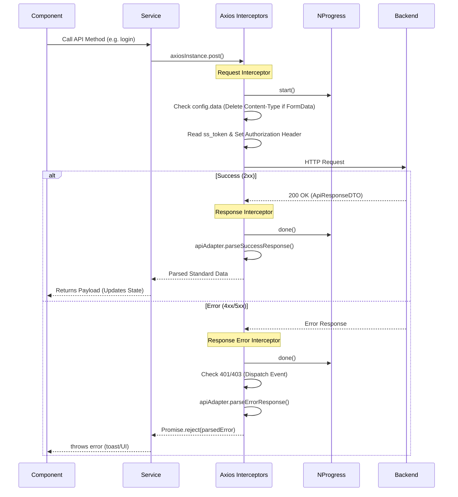

# API and Axios Execution Flow Deep Dive

> **What:** Line-by-line execution flow for API requests, response parsing, and error handling.
> **Why:** A Principal Engineer needs to know exactly how data leaves a component, traverses the network, gets standardized, and flows back into React state.

---

## 1. The Global Axios Interceptor Flow

### Request & Response Flow



---

## 2. Global Error and Toast Flow

### When Backend Returns 4xx / 5xx

```text
Backend returns 401 Unauthorized
↓
Axios Response Interceptor Fires (Error path):
  1. `NProgress.done()` → Stops top loading bar.
  2. Checks `error.response?.status`:
     - If 401: 
       └─ `localStorage.removeItem('ss_token')`
       └─ `localStorage.removeItem('ss_user')`
       └─ `window.dispatchEvent(new CustomEvent('auth:unauthorized'))`
     - If 403:
       └─ `window.dispatchEvent(new CustomEvent('auth:forbidden'))`
     - If 500 or network failure:
       └─ `window.dispatchEvent(new CustomEvent('api:error', { detail: message }))`
  3. Parses the error body using `parseErrorResponse(error)` in `apiAdapter.js`:
     └─ Extracts `fieldErrors` map (if Validation error).
     └─ Extracts `message` (if Custom Exception).
  4. Returns `Promise.reject(parsedError)`
↓
GlobalApiHandler (`src/components/common/GlobalApiHandler.jsx`) catches custom events:
  - 'auth:unauthorized' → Calls `logout(true)` → React Router immediately redirects to `/login`.
  - 'auth:forbidden' → Navigates to `/unauthorized`.
  - 'api:error' → Calls `toast.error(detail)`.
↓
Component catches the rejected Promise (`catch (err)`):
  1. Form/Page executes: `toast.error(err.message)`.
  2. If using `useApiForm`, `fieldErrors` are stored in state → inline red text appears under inputs.
  3. `setLoading(false)` → Button spinner stops.
```

---

## 3. File Upload Flow (Raise Claim / Document Upload)

When uploading files (e.g., Claim Documents), the execution path must handle `Blob` and `File` binary objects via `FormData`.

```text
User selects a file in <input type="file" />
↓
Component `onChange` event:
  1. Reads `e.target.files`.
  2. Updates `useState(selectedFiles)` array.
↓
User clicks "Upload"
↓
Component creates `FormData`:
  1. `const formData = new FormData()`
  2. Iterates over `selectedFiles`: `formData.append('files', file)`
  3. Calls `claimService.uploadDocuments(claimId, formData)`
↓
Service calls Axios:
  └─ `axiosInstance.post('/document/upload/${claimId}', formData)`
↓
Request Interceptor recognizes `config.data instanceof FormData`:
  └─ Strips `Content-Type` header so browser calculates the boundary string.
↓
Network request sent (multipart/form-data)
↓
Backend processes chunked upload → saves to Cloudinary → links URLs to DB → returns 200 OK.
↓
Axios Response Interceptor parses the response.
↓
Component receives `{ success: true, message: "Documents uploaded" }`.
↓
Component calls `toast.success()`.
↓
React Router redirects user (`navigate(destination)`).
```

---

## 4. API Standardization (Why `apiAdapter.js` exists)

Because the Backend wraps all responses in an `ApiResponseDTO` (which looks like `{ success: true, message: "...", data: { ... } }`), doing `response.data.data` everywhere in the frontend is fragile.

The adapter acts as a middleware that normalizes:
1. Standard Objects.
2. Lists (`List<T>`).
3. Paginated Responses (`PageResponseDTO`).
4. Validation Errors (`ValidationErrorResponseDTO` containing a Map of field errors).

This means components can confidently destructure:
`const { data, message, pagination } = await service.getSomething()`
Without worrying about the underlying payload shape.
