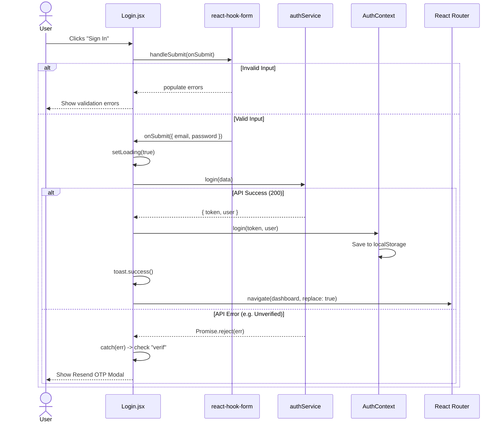
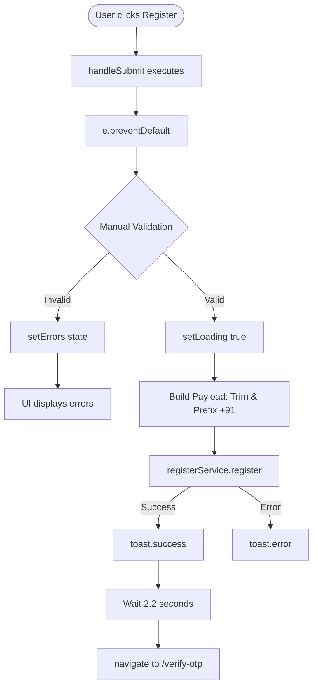

# Authentication Execution Flow Deep Dive

> **What:** Line-by-line execution flow for Login and Register workflows.
> **Why:** Demonstrates two different approaches to forms (`react-hook-form` vs. controlled components) and exactly how auth context is synchronized with local storage and routing.

---

## 1. Login Flow (Using `react-hook-form`)

`Login.jsx` utilizes `react-hook-form` for uncontrolled, high-performance input validation.

### Keystroke and Validation Flow

```text
User types in Email field
↓
`react-hook-form` registers the input via `{...register("email", { required, pattern })}`
↓
User clicks away (blur)
↓
`mode: "onTouched"` configuration triggers validation rules.
↓
If invalid: 
  └─ `errors.email` object is populated.
  └─ Component Re-renders.
  └─ `<div id="email-error">` appears with red text.
```

### Submit Execution Flow



---

## 2. Register Flow (Using Controlled Components)

`Register.jsx` uses standard React state (`useState(formData)`) for two-way binding. This allows for complex real-time side-effects (like the Password Strength meter and real-time Confirm Password check).

### Keystroke and Real-Time Validation Flow

```text
User types in "Confirm Password"
↓
`onChange={handleChange}` fires.
↓
Extracts `name="confirmPassword"`, `value="Typing..."`
↓
`setFormData` updates state.
↓
Inside `handleChange`, conditional logic checks:
  `if (name === 'confirmPassword' || name === 'password')`
↓
Compares `password` vs `confirmPassword`.
  - If they do NOT match: `setErrors({ confirmPassword: 'Passwords do not match.' })`
  - If they MATCH: `setErrors({ confirmPassword: '' })`
↓
Component Re-renders immediately.
↓
UI shows green "Passwords match!" or red error text instantly.
```

### Password Strength Meter Flow

```text
User types in "Password"
↓
Component Re-renders due to `formData.password` state update.
↓
`<PasswordStrength password={formData.password} />` component re-evaluates:
  1. Score = 0
  2. Length >= 6 ? Score++
  3. Length >= 10 ? Score++
  4. Has UpperCase ? Score++
  5. Has Number ? Score++
  6. Has Special Char ? Score++
↓
Maps `score` (0-5) to a color (Red → Orange → Yellow → Green → Emerald).
↓
Renders 5 flex-bars. Bars index < score get colored, rest get gray.
```

### Submit Execution Flow


