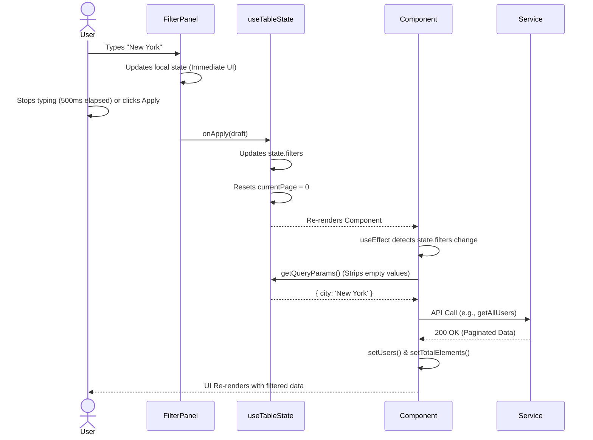

# Filtering and Search Execution Flow Deep Dive

> **What:** Line-by-line execution flow of how the Application handles Filtering and Searching across Admin grids (Users, Customers, Policies).
> **Why:** The system uses a highly optimized, debounced, and centralized filter state mechanism rather than triggering API calls on every keystroke. This document explains the synchronization between `useTableState`, `useDebounceFilters`, `<FilterPanel>`, and the backend.

---

## 1. Filter Registration (Component Mount)

**Example Entry Point:** `/admin/users`, `/admin/customers`, `/admin/policies`

Every list page begins by defining a static `FILTER_FIELDS` configuration array.

```text
Component evaluates `FILTER_FIELDS` outside the render cycle.
↓
`<UserListPage />` mounts.
↓
State initialized via Custom Hook:
  `const tableState = useTableState({ initialFilters: { city: '', state: '' } })`
↓
Debounce Hook initialized:
  `const { localFilters, handleFilterChange, clearFilters } = useDebounceFilters(tableState.filters, tableState.handleFilterChange)`
↓
Resulting State:
  1. `tableState.filters`: The source of truth for what is currently applied to the API.
  2. `localFilters`: The draft state that the user is actively typing into.
```

## 2 & 3. Keystroke Debounce & API Execution Flow



## 4. Filter Chips & Removal Flow

```text
User clicks the "X" on a active filter chip (e.g., [City: New York ✖]).
↓
`<FilterChips />` triggers `onRemove({ city: '' })`.
↓
`tableState.handleFilterChange({ city: '' })` executes.
↓
`tableState.filters` updates.
↓
`useDebounceFilters` detects the upstream prop change and syncs `localFilters` automatically to match the cleared state.
↓
`useEffect` detects the filter change.
↓
API is recalled without the `city` parameter.
```

## Summary of Responsibilities

*   **`useTableState`**: Owns the true filter state, pagination math, and sorting. Exposes `getQueryParams()` to easily serialize state into Axios params.
*   **`useDebounceFilters`**: Owns the "draft" state to prevent the UI from lagging while the user types, and prevents hammering the backend with API calls on every keystroke.
*   **`<FilterPanel>`**: Pure UI component. Maps over `FILTER_FIELDS` to render text inputs, selects, or date pickers.
*   **`<FilterChips>`**: Pure UI component. Reads active filters and renders removable tags for visual feedback.
