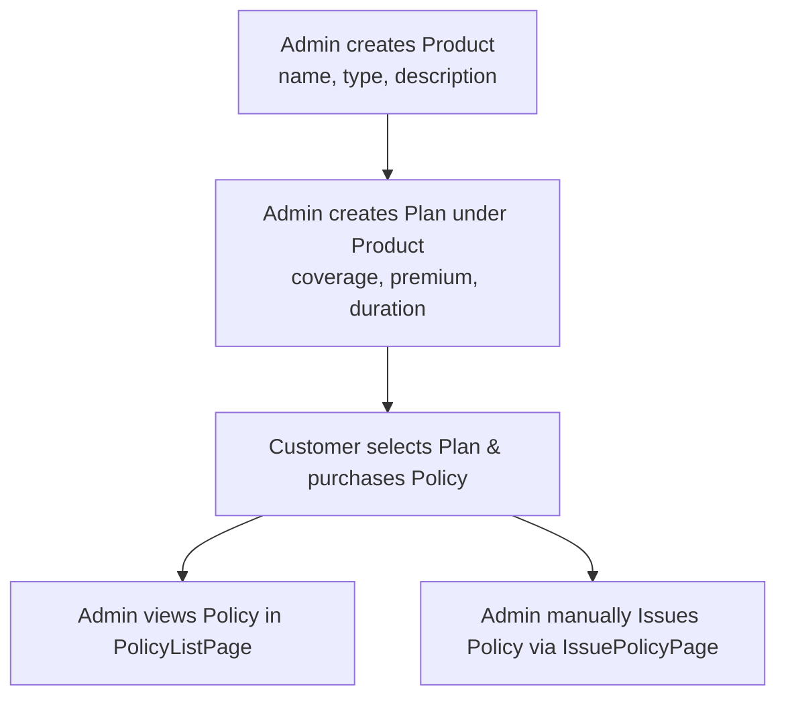
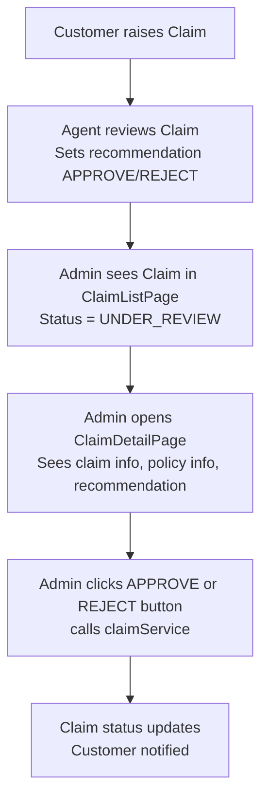

# 🛡️ Admin Flow

> Covers all pages under `pages/admin/` - the full admin-side feature set of the Insurance Management System.

---

## 📌 Overview

The **Admin** is the most privileged role. Admin can:

- Manage **Insurance Products** (CRUD)
- Manage **Policy Plans** under each product (CRUD)
- View all **Customers** and their details
- View all **Policies** and **Issue policies** manually
- View all **Premium Payments**
- Review, Approve, or Reject **Claims** (final decision)
- Create **Agent accounts**
- View all **Users** (Admins, Agents, Customers)
- Access **Reports & Analytics**

---

## 🗂️ Pages & Files Involved

### 📊 Dashboard

| File                                 | Purpose                                                   |
| ------------------------------------ | --------------------------------------------------------- |
| `pages/admin/AdminDashboard.jsx`     | KPI cards - total policies, active claims, revenue, users |
| `services/dashboardService.js`       | `getAdminStats()` API call                                |
| `components/cards/DashboardCard.jsx` | Reusable stat card component                              |

---

### 🏭 Products (Insurance Products)

| File                                         | Purpose                                                                     |
| -------------------------------------------- | --------------------------------------------------------------------------- |
| `pages/admin/products/ProductListPage.jsx`   | Table of all products with Edit/Delete actions                              |
| `pages/admin/products/CreateProductPage.jsx` | Form to add a new product                                                   |
| `pages/admin/products/EditProductPage.jsx`   | Pre-filled form to update a product                                         |
| `services/productService.js`                 | `getAllProducts()`, `createProduct()`, `updateProduct()`, `deleteProduct()` |

---

### 📋 Plans (Policy Plans per Product)

| File                                   | Purpose                                                               |
| -------------------------------------- | --------------------------------------------------------------------- |
| `pages/admin/plans/PlanListPage.jsx`   | Table of plans (filter by product)                                    |
| `pages/admin/plans/CreatePlanPage.jsx` | Form to add a plan under a product                                    |
| `pages/admin/plans/EditPlanPage.jsx`   | Form to edit existing plan                                            |
| `services/planService.js`              | `getPlansByProduct()`, `createPlan()`, `updatePlan()`, `deletePlan()` |

---

### 👥 Customers

| File                                           | Purpose                                   |
| ---------------------------------------------- | ----------------------------------------- |
| `pages/admin/customers/CustomerListPage.jsx`   | Paginated list of all customers           |
| `pages/admin/customers/CustomerDetailPage.jsx` | Full customer profile + policies + claims |
| `services/customerService.js`                  | `getAllCustomers()`, `getCustomerById()`  |

---

### 📄 Policies

| File                                       | Purpose                                        |
| ------------------------------------------ | ---------------------------------------------- |
| `pages/admin/policies/PolicyListPage.jsx`  | All policies with status filter                |
| `pages/admin/policies/IssuePolicyPage.jsx` | Form to manually issue a policy for a customer |
| `services/policyService.js`                | `getAllPolicies()`, `issuePolicy()`            |

---

### 💳 Payments

| File                                       | Purpose                     |
| ------------------------------------------ | --------------------------- |
| `pages/admin/payments/PaymentListPage.jsx` | All premium payment records |
| `services/paymentService.js`               | `getAllPayments()`          |

---

### 📝 Claims

| File                                     | Purpose                                                                   |
| ---------------------------------------- | ------------------------------------------------------------------------- |
| `pages/admin/claims/ClaimListPage.jsx`   | All claims - filter by status (PENDING, UNDER_REVIEW, APPROVED, REJECTED) |
| `pages/admin/claims/ClaimDetailPage.jsx` | Full claim detail + agent recommendation + approve/reject action          |
| `services/claimService.js`               | `getAllClaims()`, `getClaimById()`, `approveClaim()`, `rejectClaim()`     |

---

### 👤 Users & Agents

| File                                    | Purpose                          |
| --------------------------------------- | -------------------------------- |
| `pages/admin/users/UserListPage.jsx`    | All system users list            |
| `pages/admin/users/CreateAgentPage.jsx` | Form to create an Agent account  |
| `services/userService.js`               | `getAllUsers()`, `createAgent()` |

---

### 📈 Reports

| File                                  | Purpose                                                              |
| ------------------------------------- | -------------------------------------------------------------------- |
| `pages/admin/reports/ReportsPage.jsx` | Visual charts - claims by status, revenue, policies issued over time |
| `services/dashboardService.js`        | `getReportData()`                                                    |

---

## 🔄 Admin Workflow Diagrams

### Product → Plan → Policy chain

### Claim Approval Workflow

---

## 🧩 Component Usage Map

| Component        | Used In                                   |
| ---------------- | ----------------------------------------- |
| `DashboardCard`  | AdminDashboard                            |
| `DataTable`      | All List pages                            |
| `PaginationBar`  | All List pages                            |
| `PageHeader`     | All pages                                 |
| `FormInput`      | Create/Edit forms                         |
| `FormSelect`     | CreatePlanPage, IssuePolicyPage           |
| `FormTextarea`   | CreateProductPage, ClaimDetailPage        |
| `ConfirmModal`   | Delete product/plan, approve/reject claim |
| `AlertModal`     | Success & error feedback                  |
| `StatusBadge`    | Claim status, Policy status               |
| `RoleBadge`      | UserListPage                              |
| `EmptyState`     | When lists have no data                   |
| `ErrorAlert`     | API error display                         |
| `LoadingSpinner` | While data fetches                        |

---

## 📐 Concepts to Learn

| Concept                    | Applied In                         | Resource                                                                   |
| -------------------------- | ---------------------------------- | -------------------------------------------------------------------------- |
| CRUD pattern with Axios    | ProductListPage, PlanListPage      | [Axios CRUD Guide](https://axios-http.com/docs/api_intro)                  |
| Controlled Forms in React  | Create/Edit pages                  | [React Forms Docs](https://react.dev/reference/react-dom/components/input) |
| React useState + useEffect | All pages                          | [React Hooks Docs](https://react.dev/reference/react/hooks)                |
| Pagination with API        | DataTable + PaginationBar          | [usePagination hook]                                                       |
| React Router useParams     | Detail pages (e.g., `/claims/:id`) | [useParams API](https://reactrouter.com/api/hooks/useParams)               |
| React Router useNavigate   | Form submit redirects              | [useNavigate API](https://reactrouter.com/api/hooks/useNavigate)           |
| Bootstrap Modal            | ConfirmModal, AlertModal           | [Bootstrap 5 Modal](https://getbootstrap.com/docs/5.3/components/modal/)   |
| Conditional rendering      | Status-based actions               | React docs                                                                 |

---

## 📡 API Endpoints Reference

| Action              | Method | Endpoint                    |
| ------------------- | ------ | --------------------------- |
| Get all products    | GET    | `/api/products`             |
| Create product      | POST   | `/api/products`             |
| Update product      | PUT    | `/api/products/{id}`        |
| Delete product      | DELETE | `/api/products/{id}`        |
| Get all plans       | GET    | `/api/plans?productId={id}` |
| Create plan         | POST   | `/api/plans`                |
| Update plan         | PUT    | `/api/plans/{id}`           |
| Delete plan         | DELETE | `/api/plans/{id}`           |
| Get all policies    | GET    | `/api/policies`             |
| Issue policy        | POST   | `/api/policies/issue`       |
| Get all claims      | GET    | `/api/claims`               |
| Approve claim       | PUT    | `/api/claims/{id}/approve`  |
| Reject claim        | PUT    | `/api/claims/{id}/reject`   |
| Get all users       | GET    | `/api/users`                |
| Create agent        | POST   | `/api/users/agent`          |
| Get dashboard stats | GET    | `/api/dashboard/admin`      |

---

## ✅ Admin Checklist

- [ ] `AdminDashboard.jsx` - KPI cards with live stats
- [ ] Products CRUD - List, Create, Edit pages + productService
- [ ] Plans CRUD - List, Create, Edit pages + planService
- [ ] Customer view - List + Detail pages
- [ ] Policy view - List + Issue Policy page
- [ ] Payment view - List page
- [ ] Claims management - List + Detail + Approve/Reject
- [ ] User management - List + Create Agent
- [ ] Reports page
- [ ] All routes registered in `App.jsx` under `/admin/*`

---

## ⚠️ Common Pitfalls

| Issue                               | Fix                                                                 |
| ----------------------------------- | ------------------------------------------------------------------- |
| Deleting product with linked plans  | Show warning modal; backend should cascade or reject                |
| Claim approve button always visible | Only show when claim status is `UNDER_REVIEW`                       |
| Pagination breaks on filter change  | Reset `currentPage` to 1 when filter changes                        |
| Edit page shows empty form          | Pre-fill form from API in `useEffect` using `useParams` to get `id` |
