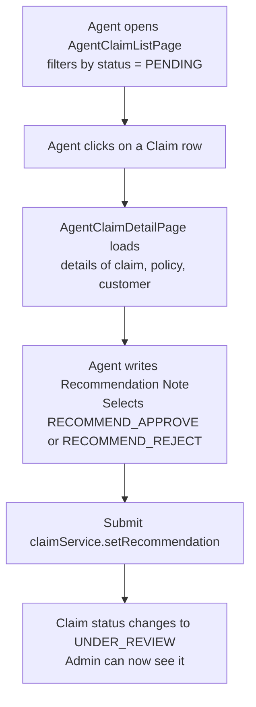
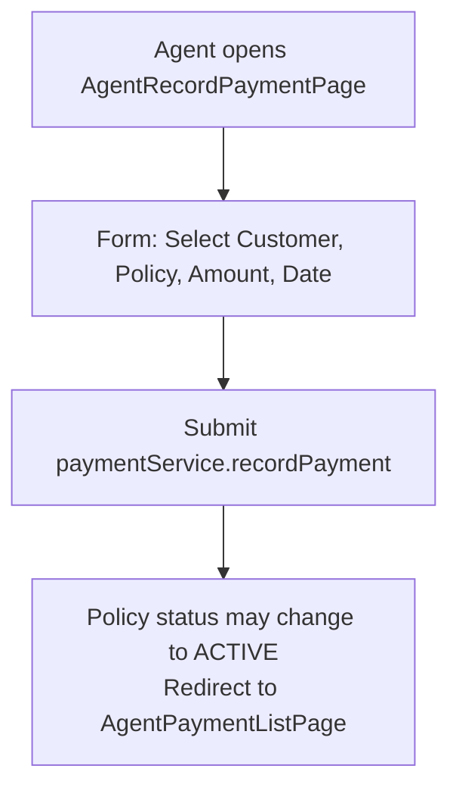
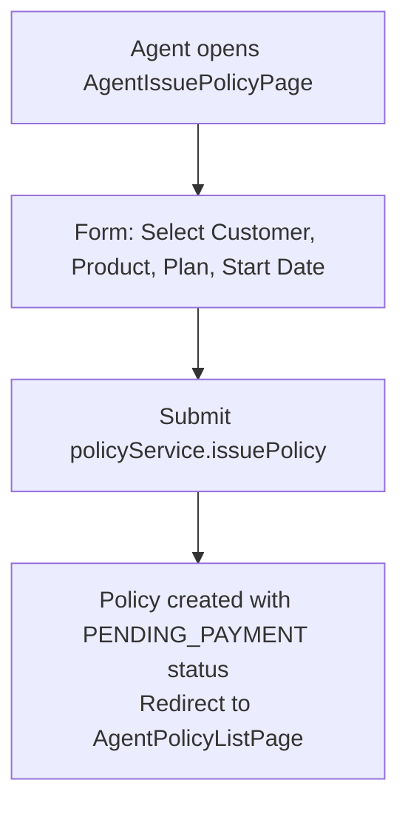

# 🕵️ Agent Flow

> Covers all pages under `pages/agent/` - the Agent-side feature set.

---

## 📌 Overview

An **Agent** acts as a middle-tier reviewer. Agent can:

- View their own **Agent Dashboard**
- Browse assigned / all **Customers**
- View **Policies** of customers
- Review **Claims** → set a recommendation (Approve / Reject)
- View **Payments**
- Record **Payments** on behalf of customers

> ❗ An Agent **cannot** create products, plans, or make final claim decisions (that's Admin's job).

---

## 🗂️ Pages & Files Involved

### 📊 Dashboard

| File                                 | Purpose                                                        |
| ------------------------------------ | -------------------------------------------------------------- |
| `pages/agent/AgentDashboard.jsx`     | KPI cards - total customers, pending claims, policies reviewed |
| `services/dashboardService.js`       | `getAgentStats()`                                              |
| `components/cards/DashboardCard.jsx` | Stat card component                                            |

---

### 👥 Customers

| File                                                | Purpose                                   |
| --------------------------------------------------- | ----------------------------------------- |
| `pages/agent/customers/AgentCustomerListPage.jsx`   | Paginated list of customers agent can see |
| `pages/agent/customers/AgentCustomerDetailPage.jsx` | Customer profile, their policies & claims |
| `services/customerService.js`                       | `getAllCustomers()`, `getCustomerById()`  |

---

### 📄 Policies

| File                                            | Purpose                             |
| ----------------------------------------------- | ----------------------------------- |
| `pages/agent/policies/AgentPolicyListPage.jsx`  | All policies (with status filter)   |
| `pages/agent/policies/AgentIssuePolicyPage.jsx` | Issue a new policy for a customer   |
| `services/policyService.js`                     | `getAllPolicies()`, `issuePolicy()` |

---

### 📝 Claims

| File                                          | Purpose                                                   |
| --------------------------------------------- | --------------------------------------------------------- |
| `pages/agent/claims/AgentClaimListPage.jsx`   | All claims - filter by status (PENDING, UNDER_REVIEW)     |
| `pages/agent/claims/AgentClaimDetailPage.jsx` | Claim detail + form to set agent recommendation           |
| `services/claimService.js`                    | `getAllClaims()`, `getClaimById()`, `setRecommendation()` |

---

### 💳 Payments

| File                                              | Purpose                                 |
| ------------------------------------------------- | --------------------------------------- |
| `pages/agent/payments/AgentPaymentListPage.jsx`   | All payment records                     |
| `pages/agent/payments/AgentRecordPaymentPage.jsx` | Form to record a payment for a customer |
| `services/paymentService.js`                      | `getAllPayments()`, `recordPayment()`   |

---

## 🔄 Agent Workflow Diagrams

### Claim Review Workflow (Agent's core job)

### Record Payment Workflow

### Issue Policy Workflow (Agent)

---

## 🧩 Component Usage Map

| Component        | Used In                                          |
| ---------------- | ------------------------------------------------ |
| `DashboardCard`  | AgentDashboard                                   |
| `DataTable`      | All list pages                                   |
| `PaginationBar`  | All list pages                                   |
| `PageHeader`     | All pages                                        |
| `FormInput`      | Record Payment, Issue Policy                     |
| `FormSelect`     | Claim recommendation dropdown, policy issue form |
| `FormTextarea`   | Agent recommendation notes                       |
| `StatusBadge`    | Claim & Policy status display                    |
| `ConfirmModal`   | Confirm recommendation submission                |
| `AlertModal`     | Success/error messages                           |
| `EmptyState`     | Empty list states                                |
| `ErrorAlert`     | API error display                                |
| `LoadingSpinner` | During data fetch                                |

---

## 📐 Concepts to Learn

| Concept                                   | Applied In                                       | Resource                                                              |
| ----------------------------------------- | ------------------------------------------------ | --------------------------------------------------------------------- |
| `useParams` for detail pages              | AgentClaimDetailPage, AgentCustomerDetailPage    | [React Router useParams](https://reactrouter.com/api/hooks/useParams) |
| Conditional UI by status                  | Show recommendation form only for PENDING claims | React conditional rendering                                           |
| `useEffect` with dependencies             | Re-fetch when filter changes                     | [React useEffect](https://react.dev/reference/react/useEffect)        |
| Controlled `<select>` forms               | Recommendation dropdown                          | React controlled components                                           |
| Filtering data client-side vs server-side | Claim list filter                                | Depends on API design                                                 |
| Form submission + loading state           | AgentRecordPaymentPage                           | useState pattern                                                      |

---

## 📡 API Endpoints Reference

| Action             | Method | Endpoint                     |
| ------------------ | ------ | ---------------------------- |
| Get all customers  | GET    | `/api/customers`             |
| Get customer by ID | GET    | `/api/customers/{id}`        |
| Get all policies   | GET    | `/api/policies`              |
| Issue policy       | POST   | `/api/policies/issue`        |
| Get all claims     | GET    | `/api/claims`                |
| Get claim by ID    | GET    | `/api/claims/{id}`           |
| Set recommendation | PUT    | `/api/claims/{id}/recommend` |
| Get all payments   | GET    | `/api/payments`              |
| Record payment     | POST   | `/api/payments`              |
| Get agent stats    | GET    | `/api/dashboard/agent`       |

---

## 🔒 Access Restrictions

| Action                     | Agent Can?         |
| -------------------------- | ------------------ |
| View all customers         | ✅ Yes             |
| Edit customer data         | ❌ No              |
| Issue policy               | ✅ Yes             |
| Create product/plan        | ❌ No              |
| Review claim → recommend   | ✅ Yes             |
| Final approve/reject claim | ❌ No (Admin only) |
| Record payment             | ✅ Yes             |
| View all payments          | ✅ Yes             |
| Manage users               | ❌ No              |

---

## ✅ Agent Checklist

- [ ] `AgentDashboard.jsx` - stat cards
- [ ] Customers - List + Detail pages
- [ ] Policies - List + Issue Policy pages
- [ ] Claims - List + Detail + Recommendation form
- [ ] Payments - List + Record Payment pages
- [ ] All routes under `/agent/*` in `App.jsx`
- [ ] `RoleProtectedRoute` wrapping all agent routes

---

## ⚠️ Common Pitfalls

| Issue                                        | Fix                                                                                       |
| -------------------------------------------- | ----------------------------------------------------------------------------------------- |
| Agent can access admin routes                | `RoleProtectedRoute` must check exact role                                                |
| Recommendation form shows on resolved claims | Conditionally render only when `claim.status === 'PENDING'`                               |
| Payment doesn't activate policy              | Backend logic handles status transition; frontend just shows updated status after refetch |
| Customer list too large                      | Use server-side pagination + `usePagination` hook                                         |
