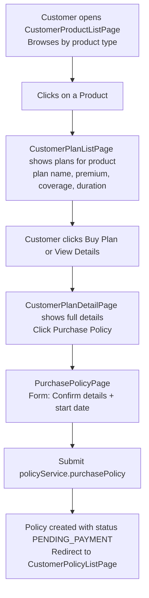
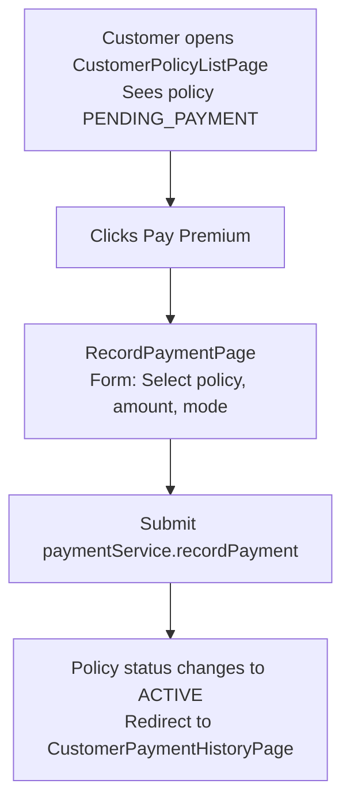
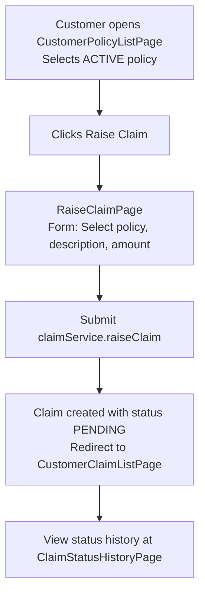
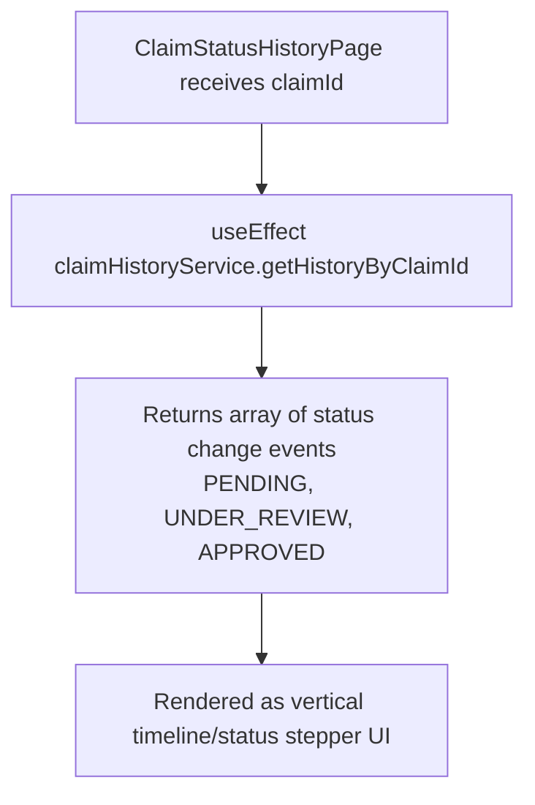

# 👤 Customer Flow

> Covers all pages under `pages/customer/` - the self-service portal for insured customers.

---

## 📌 Overview

A **Customer** is the end-user of the insurance system. Customer can:

- View their own **Dashboard**
- Browse available **Products** and **Plans**
- **Purchase a Policy** (select a plan → create a policy)
- View their **Policies**
- **Record Premium Payments** for their active policies
- **Raise a Claim** against an active policy
- View **Claim Status & History**
- View their **Payment History**
- Manage their **Profile**

> ❗ Customers can **only see their own data** - no cross-user access.

---

## 🗂️ Pages & Files Involved

### 📊 Dashboard

| File                                   | Purpose                                                     |
| -------------------------------------- | ----------------------------------------------------------- |
| `pages/customer/CustomerDashboard.jsx` | Summary cards - active policies, pending claims, total paid |
| `services/dashboardService.js`         | `getCustomerStats()`                                        |
| `components/cards/DashboardCard.jsx`   | Stat card component                                         |

---

### 🏭 Products & Plans (Browse)

| File                                                  | Purpose                                               |
| ----------------------------------------------------- | ----------------------------------------------------- |
| `pages/customer/products/CustomerProductListPage.jsx` | Browse all available insurance products               |
| `pages/customer/plans/CustomerPlanListPage.jsx`       | Browse plans under a selected product                 |
| `pages/customer/plans/CustomerPlanDetailPage.jsx`     | Detailed view of a plan (coverage, premium, duration) |
| `services/productService.js`                          | `getAllProducts()`                                    |
| `services/planService.js`                             | `getPlansByProduct()`, `getPlanById()`                |

---

### 📄 Policies

| File                                                 | Purpose                               |
| ---------------------------------------------------- | ------------------------------------- |
| `pages/customer/policies/CustomerPolicyListPage.jsx` | All customer's own policies           |
| `pages/customer/policies/PurchasePolicyPage.jsx`     | Purchase a policy by selecting a plan |
| `services/policyService.js`                          | `getMyPolicies()`, `purchasePolicy()` |

---

### 💳 Payments

| File                                                     | Purpose                               |
| -------------------------------------------------------- | ------------------------------------- |
| `pages/customer/payments/CustomerPaymentHistoryPage.jsx` | All payment records for this customer |
| `pages/customer/payments/RecordPaymentPage.jsx`          | Pay premium for a policy              |
| `services/paymentService.js`                             | `getMyPayments()`, `recordPayment()`  |

---

### 📝 Claims

| File                                               | Purpose                                              |
| -------------------------------------------------- | ---------------------------------------------------- |
| `pages/customer/claims/CustomerClaimListPage.jsx`  | All claims raised by this customer                   |
| `pages/customer/claims/RaiseClaimPage.jsx`         | Form to raise a new claim against a policy           |
| `pages/customer/claims/ClaimStatusHistoryPage.jsx` | Timeline/history of status changes for a claim       |
| `services/claimService.js`                         | `getMyClaims()`, `raiseClaim()`, `getClaimHistory()` |
| `services/claimHistoryService.js`                  | `getHistoryByClaimId()`                              |

---

### 👤 Profile

| File                                             | Purpose                             |
| ------------------------------------------------ | ----------------------------------- |
| `pages/customer/profile/CustomerProfilePage.jsx` | View profile information            |
| `pages/customer/profile/EditProfilePage.jsx`     | Edit name, phone, address, etc.     |
| `services/customerService.js`                    | `getMyProfile()`, `updateProfile()` |

---

## 🔄 Customer Workflow Diagrams

### Policy Purchase Workflow

### Premium Payment Workflow

### Raise Claim Workflow

---

## 🔄 Claim Status History (Timeline View)

---

## 🧩 Component Usage Map

| Component        | Used In                                               |
| ---------------- | ----------------------------------------------------- |
| `DashboardCard`  | CustomerDashboard                                     |
| `DataTable`      | Policy list, Claim list, Payment list                 |
| `PaginationBar`  | All list pages                                        |
| `PageHeader`     | All pages                                             |
| `FormInput`      | RaiseClaimPage, RecordPaymentPage, EditProfilePage    |
| `FormSelect`     | RecordPaymentPage (policy select), PurchasePolicyPage |
| `FormTextarea`   | RaiseClaimPage (claim description)                    |
| `StatusBadge`    | Policy status, Claim status                           |
| `AlertModal`     | Claim raised success, payment success                 |
| `ConfirmModal`   | Confirm claim submission, confirm payment             |
| `EmptyState`     | No policies yet, no claims yet                        |
| `ErrorAlert`     | API errors                                            |
| `LoadingSpinner` | Fetching data                                         |

---

## 📐 Concepts to Learn

| Concept                             | Applied In                                    | Resource                                                              |
| ----------------------------------- | --------------------------------------------- | --------------------------------------------------------------------- |
| Reading logged-in user from context | All pages (customer sees only their own data) | `useAuth()` hook                                                      |
| `useParams`                         | ClaimStatusHistoryPage, PlanDetailPage        | [React Router useParams](https://reactrouter.com/api/hooks/useParams) |
| `useNavigate` with state            | Pass planId from PlanList to PurchasePage     | [useNavigate + state](https://reactrouter.com/api/hooks/useNavigate)  |
| `useEffect` data fetching           | All pages                                     | [React useEffect](https://react.dev/reference/react/useEffect)        |
| Optimistic UI vs. Refetch           | After record payment, refetch policy          | React state management                                                |
| Timeline/Stepper UI                 | ClaimStatusHistoryPage                        | Custom CSS or Bootstrap progress                                      |
| Form pre-population                 | Edit Profile (pre-fill from API)              | Controlled input pattern                                              |

---

## 📡 API Endpoints Reference

| Action               | Method | Endpoint                    |
| -------------------- | ------ | --------------------------- |
| Get all products     | GET    | `/api/products`             |
| Get plans by product | GET    | `/api/plans?productId={id}` |
| Get plan by ID       | GET    | `/api/plans/{id}`           |
| Get my policies      | GET    | `/api/policies/my`          |
| Purchase policy      | POST   | `/api/policies/purchase`    |
| Get my payments      | GET    | `/api/payments/my`          |
| Record payment       | POST   | `/api/payments`             |
| Get my claims        | GET    | `/api/claims/my`            |
| Raise a claim        | POST   | `/api/claims`               |
| Get claim history    | GET    | `/api/claims/{id}/history`  |
| Get my profile       | GET    | `/api/customers/me`         |
| Update my profile    | PUT    | `/api/customers/me`         |
| Get customer stats   | GET    | `/api/dashboard/customer`   |

---

## 🔒 Access Restrictions

| Action                   | Customer Can?      |
| ------------------------ | ------------------ |
| View all customers       | ❌ No              |
| View own profile         | ✅ Yes             |
| Edit own profile         | ✅ Yes             |
| Browse products & plans  | ✅ Yes (read-only) |
| Create products/plans    | ❌ No              |
| Purchase policy          | ✅ Yes             |
| Issue policy for others  | ❌ No              |
| Record own payment       | ✅ Yes             |
| View own payment history | ✅ Yes             |
| Raise a claim            | ✅ Yes             |
| View own claims          | ✅ Yes             |
| Review/approve claims    | ❌ No              |

---

## ✅ Customer Checklist

- [ ] `CustomerDashboard.jsx` - stat cards
- [ ] Products browse - `CustomerProductListPage`
- [ ] Plans browse - `CustomerPlanListPage` + `CustomerPlanDetailPage`
- [ ] Policies - `CustomerPolicyListPage` + `PurchasePolicyPage`
- [ ] Payments - `CustomerPaymentHistoryPage` + `RecordPaymentPage`
- [ ] Claims - `CustomerClaimListPage` + `RaiseClaimPage` + `ClaimStatusHistoryPage`
- [ ] Profile - `CustomerProfilePage` + `EditProfilePage`
- [ ] All routes under `/customer/*` in `App.jsx`
- [ ] `RoleProtectedRoute` wrapping all customer routes

---

## ⚠️ Common Pitfalls

| Issue                                              | Fix                                                                |
| -------------------------------------------------- | ------------------------------------------------------------------ |
| Customer can raise claim on PENDING_PAYMENT policy | Validate that policy status is `ACTIVE` before allowing claim form |
| PurchasePolicyPage doesn't know the plan           | Pass `planId` via React Router `state` or URL param                |
| EditProfile form shows stale data                  | Always fetch fresh data in `useEffect` on mount                    |
| Claim history page shows empty                     | Check that `claimId` is correct - use `useParams`                  |
| Pay Premium button shown on already-active policy  | Hide/disable button when policy is already `ACTIVE`                |
