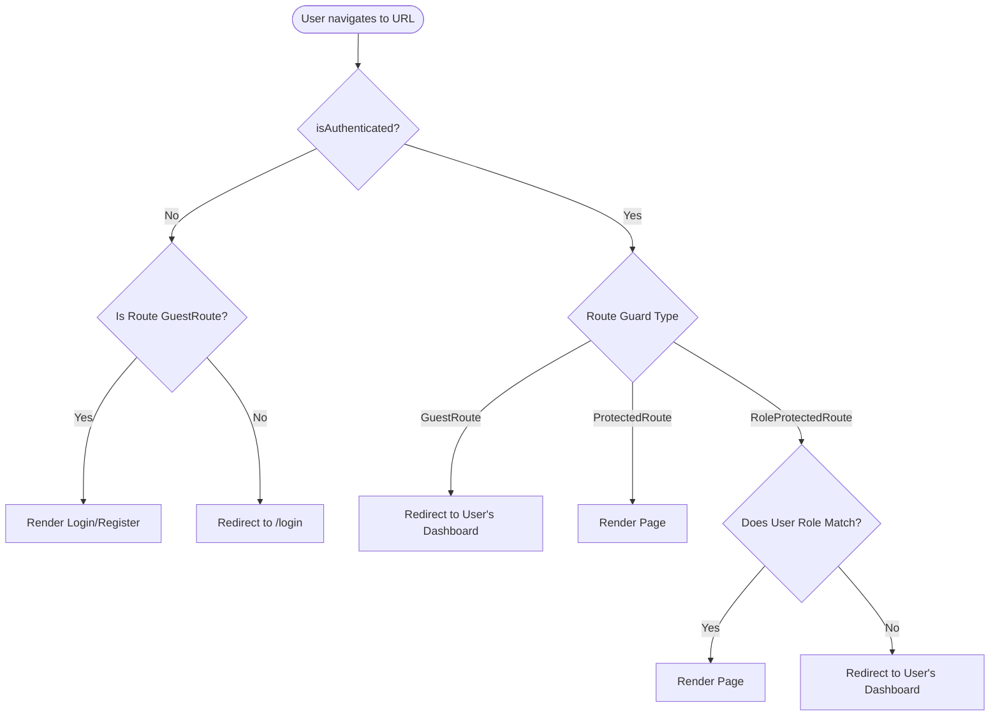

# Routing

> **What:** Complete routing map for the InsureFlow application.  
> **Why:** Understanding routes is the first step to understanding page ownership, access control, and navigation flow.  
> **How:** React Router v7 with nested routes, layout wrappers, and three route guard types.  
> **Where:** [`src/App.jsx`](../../src/App.jsx)

---

## Route Guard Types

Three guard components protect routes in `App.jsx`:



### 1. `GuestRoute`

**Purpose:** Prevents authenticated users from accessing login/register pages.

**How it works:**
- If user is authenticated → redirect to their role's dashboard
- If not authenticated → allow access

```
/login, /register, /forgot-password, /verify-otp, /
```

**Redirect Map:**
| Role | Redirects to |
|---|---|
| `ROLE_ADMIN` | `/admin/dashboard` |
| `ROLE_INTERNAL_STAFF` | `/staff/dashboard` |
| `ROLE_CUSTOMER` | `/customer/dashboard` |

---

### 2. `ProtectedRoute`

**Purpose:** Prevents unauthenticated users from accessing any application page.

**How it works:**
- Checks `isAuthenticated` from `AuthContext`
- If not authenticated → redirects to `/login` with the current location in state (for post-login redirect)
- A special `isLoggingOut` localStorage flag is checked to prevent redirect loops during logout

---

### 3. `RoleProtectedRoute`

**Purpose:** Prevents users from accessing pages that belong to a different role.

**How it works:**
- Accepts an `allowedRole` prop
- If user's role does not match → redirects to their own dashboard
- If user is not authenticated → redirects to `/login`

---

## Complete Route Map

### Public Routes (Guest only)

| Path | Component | Notes |
|---|---|---|
| `/` | `LandingPage` | Marketing/info page |
| `/login` | `Login` | Email + password form |
| `/register` | `Register` | Customer self-registration |
| `/forgot-password` | `ForgotPassword` | Email → OTP flow |
| `/verify-otp` | `VerifyOtp` | OTP verification after register/forgot |

> If an authenticated user visits these routes, `GuestRoute` redirects them to their dashboard.

---

### Shared Protected Routes (any authenticated user)

| Path | Component | Notes |
|---|---|---|
| `/dashboard` | `DashboardRedirect` | Redirects to role-specific dashboard |
| `/unauthorized` | `Unauthorized` | Shown on 403 responses |

---

### Admin Routes (`ROLE_ADMIN` only)

All wrapped in `ProtectedRoute` + `RoleProtectedRoute(ADMIN)` + `MainLayout`.

| Path | Component |
|---|---|
| `/admin/dashboard` | `AdminDashboard` |
| `/admin/users` | `UserListPage` |
| `/admin/users/create` | `CreateStaffPage` |
| `/admin/users/:id` | `UserDetailPage` |
| `/admin/customers` | `CustomerListPage` |
| `/admin/customers/:id` | `CustomerDetailPage` |
| `/admin/products` | `ProductListPage` |
| `/admin/products/create` | `CreateProductPage` |
| `/admin/products/edit/:id` | `EditProductPage` |
| `/admin/products/:id` | `ProductDetailPage` |
| `/admin/plans` | `PlanListPage` |
| `/admin/plans/create` | `CreatePlanPage` |
| `/admin/plans/edit/:id` | `EditPlanPage` |
| `/admin/plans/:id` | `PlanDetailPage` |
| `/admin/policies` | `PolicyListPage` |
| `/admin/policies/:id` | `PolicyDetailPage` |
| `/admin/policies/issue` | `IssuePolicyPage` |
| `/admin/claims` | `ClaimListPage` |
| `/admin/claims/:id` | `ClaimDetailPage` |
| `/admin/payments` | `PaymentListPage` |

---

### Staff Routes (`ROLE_INTERNAL_STAFF` only)

All wrapped in `ProtectedRoute` + `RoleProtectedRoute(INTERNAL_STAFF)` + `MainLayout`.

| Path | Component |
|---|---|
| `/staff/dashboard` | `StaffDashboard` |
| `/staff/customers` | `StaffCustomerListPage` |
| `/staff/customers/:id` | `StaffCustomerDetailPage` |
| `/staff/profile` | `ProfilePage` (shared) |
| `/staff/profile/edit` | `EditProfilePage` (shared) |
| `/staff/policies` | `StaffPolicyListPage` |
| `/staff/policies/:policyId` | `StaffPolicyDetailPage` |
| `/staff/claims` | `StaffClaimListPage` |
| `/staff/claims/:id` | `StaffClaimDetailPage` |
| `/staff/issue-policy` | `StaffIssuePolicyPage` |
| `/staff/payments` | `StaffPaymentListPage` |
| `/staff/payments/pay/:policyId` | `StaffRecordPaymentPage` |

---

### Customer Routes (`ROLE_CUSTOMER` only)

All wrapped in `ProtectedRoute` + `RoleProtectedRoute(CUSTOMER)` + `MainLayout`.

| Path | Component |
|---|---|
| `/customer/dashboard` | `CustomerDashboard` |
| `/customer/profile` | `ProfilePage` (shared) |
| `/customer/profile/edit` | `EditProfilePage` (shared) |
| `/customer/products` | `CustomerProductListPage` |
| `/customer/products/:productId/plans` | `CustomerPlanListPage` (filtered by product) |
| `/customer/plans` | `CustomerPlanListPage` (all active plans) |
| `/customer/purchase-policy/:planId` | `PurchasePolicyPage` |
| `/customer/policies` | `CustomerPolicyListPage` |
| `/customer/policies/:policyId` | `CustomerPolicyDetailPage` |
| `/customer/payments` | `CustomerPaymentHistoryPage` |
| `/customer/payments/pay/:policyId` | `RecordPaymentPage` |
| `/customer/claims` | `CustomerClaimListPage` |
| `/customer/claims/raise` | `RaiseClaimPage` |
| `/customer/claims/upload/:claimId` | `UploadDocumentsPage` |
| `/customer/claims/:claimId` | `ClaimDetailsPage` |

---

### Catch-All

| Path | Component |
|---|---|
| `*` | `NotFound` |

---

## Navigation Patterns

### Sidebar Navigation

Navigation items are defined in `UnifiedLayout.jsx` using the `NAV_ITEMS_BY_ROLE` map. Each role gets a completely separate set of nav items.

**Adding a nav item for a new page:**

```js
// In src/components/layouts/UnifiedLayout.jsx
// Inside NAV_ITEMS_BY_ROLE[ROLES.ADMIN] array:
{
  to: "/admin/new-page",
  icon: "bi-icon-name",      // Bootstrap Icons class
  label: "New Page",
  section: "Section Name",   // Optional grouping header
  end: false,                // true = exact match for active state
}
```

---

### In-Page Navigation (TopNavbar)

The `TopNavbar` shows:
- **Back button** → `navigate(-1)` (browser history)
- **Forward button** → `navigate(1)` (browser history)
- **Breadcrumb** → derived from `location.pathname` segments

---

## Zero-Latency Static Routing

All page components are loaded statically via standard ES6 `import` statements at the top of `App.jsx`:

```jsx
import Login from "./pages/auth/Login";
```

This ensures that the entire application is bundled into a single unit, eliminating network round-trips for JavaScript chunks when navigating between views. Navigation is strictly instantaneous.

---

## Route Parameters

| Pattern | Hook to Access | Example |
|---|---|---|
| `/admin/users/:id` | `useParams()` → `{ id }` | `id = "42"` |
| `/customer/policies/:policyId` | `useParams()` → `{ policyId }` | `policyId = "7"` |
| `/customer/claims/upload/:claimId` | `useParams()` → `{ claimId }` | `claimId = "15"` |
| `/admin/plans/edit/:id` | `useParams()` → `{ id }` | `id = "3"` |

---

## State Passed via Navigation

Some pages receive state from the page that navigated to them using `useLocation().state`:

| From | To | State Passed |
|---|---|---|
| `Login` | `VerifyOtp` | `{ email }` |
| `Register` | `VerifyOtp` | `{ registered: true, email }` |
| `Login` | `Login` | `{ from: location }` (redirect after auth) |

Access via:
```js
const location = useLocation();
const email = location.state?.email;
```

---

## Related Documentation

- [Architecture Overview](../architecture/overview.md)
- [Auth Pages](../pages/auth-pages.md)
- [Admin Pages](../pages/admin-pages.md)
- [Staff Pages](../pages/staff-pages.md)
- [Customer Pages](../pages/customer-pages.md)
